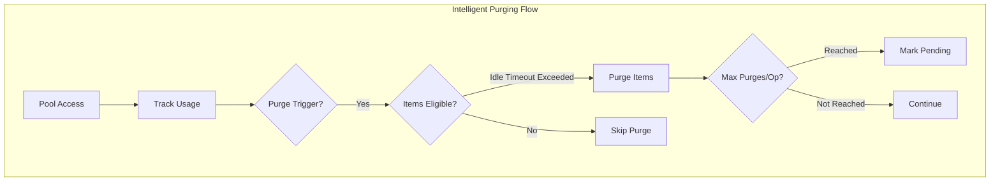
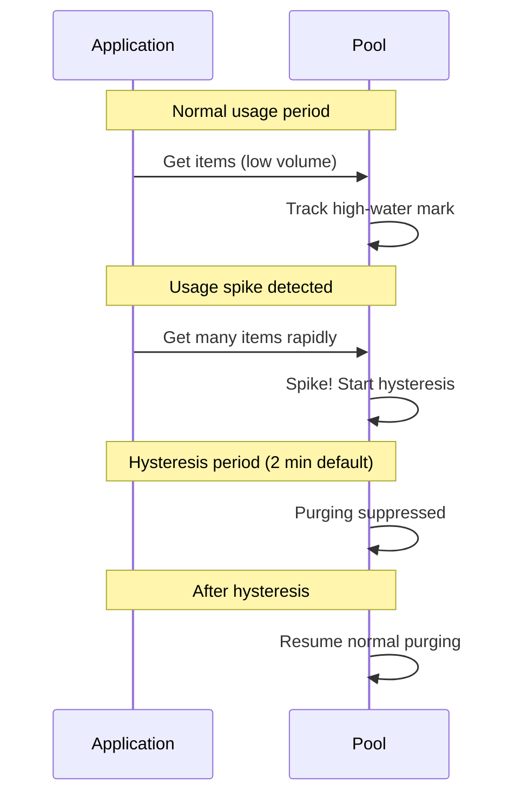

# Intelligent Pooling System

## TL;DR: Why Use This

- Automatic memory management with intelligent purging that adapts to usage patterns.
- Avoid GC spikes by spreading purges across frames and responding to memory pressure.
- Type-specific policies for different object lifetimes (short-lived lists vs long-lived audio sources).
- Zero-configuration defaults that "just work" with opt-in customization.

---

## Contents

- [Overview](#overview)
- [Quick Start](#quick-start)
- [PoolOptions Configuration](#pooloptions-configuration)
- [Global Settings (PoolPurgeSettings)](#global-settings-poolpurgesettings)
- [Eviction Policies](#eviction-policies)
- [Memory Pressure Detection](#memory-pressure-detection)
- [Size-Aware Policies](#size-aware-policies)
- [Access Frequency Tracking](#access-frequency-tracking)
- [Application Lifecycle Hooks](#application-lifecycle-hooks)
- [Global Pool Registry](#global-pool-registry)
- [Pooling IDisposable Objects](#pooling-idisposable-objects)
- [Renting an Array](#renting-an-array)
- [Borrowing a Buffer for One Operation](#borrowing-a-buffer-for-one-operation)
- [Best Practices](#best-practices)

---

## Overview

The intelligent pooling system provides automatic memory management for `WallstopGenericPool<T>` instances. Instead of pools growing unbounded or requiring manual purge calls, the system:

1. **Tracks usage patterns** - Monitors high-water marks and access frequency
2. **Purges intelligently** - Only removes items unlikely to be needed soon
3. **Spreads work** - Limits purges per operation to avoid GC spikes
4. **Responds to pressure** - Aggressive cleanup when memory is low
5. **Respects object size** - Large objects get stricter policies



---

## Quick Start

### Basic Usage (Zero Configuration)

By default, intelligent purging is **enabled** with conservative settings:

<!-- doc-sample: compiles -->

```csharp
using System.Collections.Generic;
using WallstopStudios.UnityHelpers.Utils;

// Pools automatically use intelligent purging
WallstopGenericPool<List<int>> pool = new(
    producer: () => new List<int>(),
    onGet: list => list.Clear()
);

// Disposing the lease returns the list and may trigger purging.
using PooledResource<List<int>> lease = pool.Get(out List<int> list);
list.Add(1);
list.Add(2);
```

A failed producer or `onGet` callback does not leave an active rental. If `onGet` fails after
an item is created or removed from storage, the pool retires that item through `onDisposal`
and propagates the original failure. Failed prewarming retires every item created before the
failure, including the item whose initialization failed. Acquisition callbacks run outside the
storage lock, so they can query pool state from another thread. Rental counters record attempts;
a failed attempt is removed from the active rental count.

Disposing `PooledResource<T>` runs the configured release callback before parking the item. If that
callback disposes the pool, the returning item is sent to the disposal callback exactly once and is
never added back to the disposed pool. The same guarantee holds when a lease return races
`WallstopGenericPool<T>.Dispose()` in the thread-safe build.

A purge removes its complete selected batch before running `OnPurge` and `onDisposal`, including
in `SINGLE_THREADED` builds. Those callbacks may rent, dispose or purge the same pool: the original
batch still receives each cleanup notification once, and a callback cannot rent an entry selected
for retirement. Nested purges act on the remaining pool; budget limits and minimum retention apply
when each batch is selected.

Purge and disposal snapshots use independent reusable buffers. Each thread and snapshot element
type retains at most four empty buffers, each with capacity at most 4,096 entries. Nested callbacks
hold distinct buffers until their batches finish; returning a buffer clears its item references.
Cold growth, deeper nesting and larger batches can still allocate, and oversized buffers are
discarded after cleanup.

Internal snapshot leases return each buffer once, even if the lease is copied or disposed again
after that buffer has a new owner. Cleanup runs when the owning scope exits, including early
returns and exceptions. Automatic purges acquire their snapshots only when they select an item.

A directly constructed `PooledResource<T>` with a null return callback is an inert wrapper. It
keeps the supplied resource accessible and reserves no disposal slot, even if it is never disposed.
Disposing or copying it has no effect on the resource. Wrappers with a return callback retain their
copy-safe, at-most-once release guarantee.

### Disable Globally (One-Liner Opt-Out)

<!-- doc-sample: compiles -->

```csharp
// Disable all intelligent purging
PoolPurgeSettings.DisableGlobally();
```

### Per-Type Configuration

<!-- doc-sample: compiles -->

```csharp
using WallstopStudios.UnityHelpers.Utils;

public sealed class ExpensiveObject { }

public sealed class CriticalResource { }

// Configure specific type behavior
PoolPurgeSettings.Configure<ExpensiveObject>(options =>
{
    options.IdleTimeoutSeconds = 600f;  // 10 minutes
    options.MinRetainCount = 5;         // Always keep 5
    options.WarmRetainCount = 10;       // Keep 10 when active
});

// Configure all List<T> variants
PoolPurgeSettings.ConfigureGeneric(typeof(List<>), options =>
{
    options.IdleTimeoutSeconds = 120f;  // 2 minutes
    options.BufferMultiplier = 1.5f;    // 50% buffer
});

// Disable purging for specific types
PoolPurgeSettings.Disable<CriticalResource>();
```

---

## PoolOptions Configuration

`PoolOptions<T>` provides per-pool configuration:

```csharp
using WallstopStudios.UnityHelpers.Utils;

var options = new PoolOptions<MyObject>
{
    // Size limits
    MaxPoolSize = 100,           // Hard cap on pool size
    MinRetainCount = 0,          // Absolute minimum to keep
    WarmRetainCount = 2,         // Keep 2 when active

    // Timing
    IdleTimeoutSeconds = 300f,   // 5 minutes before eligible
    PurgeIntervalSeconds = 60f,  // Periodic check interval

    // Intelligent purging
    UseIntelligentPurging = true,
    BufferMultiplier = 2.0f,     // 2x peak usage buffer
    RollingWindowSeconds = 300f, // 5 minute window
    HysteresisSeconds = 120f,    // 2 minute spike cooldown
    SpikeThresholdMultiplier = 2.5f, // 2.5x average = spike
    MaxPurgesPerOperation = 10,  // Spread large purges

    // Triggers
    Triggers = PurgeTrigger.OnRent | PurgeTrigger.OnReturn,

    // Callbacks
    OnPurge = (item, reason) => Debug.Log($"Purged: {reason}")
};

var pool = new WallstopGenericPool<MyObject>(
    createFunc: () => new MyObject(),
    options: options
);
```

### PurgeTrigger Flags

| Trigger    | Description                                  |
| ---------- | -------------------------------------------- |
| `OnRent`   | Check when item is rented (lazy cleanup)     |
| `OnReturn` | Check when item is returned                  |
| `Periodic` | Timer-based checks at `PurgeIntervalSeconds` |
| `Explicit` | Only purge when `Purge()` is called manually |

### PurgeReason Values

| Reason             | Description                                    |
| ------------------ | ---------------------------------------------- |
| `IdleTimeout`      | Item was idle longer than `IdleTimeoutSeconds` |
| `CapacityExceeded` | Pool exceeded `MaxPoolSize`                    |
| `MemoryPressure`   | System memory pressure detected                |
| `AppBackgrounded`  | Application went to background                 |
| `SceneUnloaded`    | Scene was unloaded                             |
| `Explicit`         | Manual `Purge()` call                          |
| `BudgetExceeded`   | Global pool budget exceeded                    |

---

## Global Settings (PoolPurgeSettings)

Configure system-wide defaults:

<!-- doc-sample: compiles -->

```csharp
using WallstopStudios.UnityHelpers.Utils;

// Enable/disable globally
PoolPurgeSettings.GlobalEnabled = true;

// Configure defaults
PoolPurgeSettings.DefaultGlobalIdleTimeoutSeconds = 300f;
PoolPurgeSettings.DefaultGlobalMinRetainCount = 0;
PoolPurgeSettings.DefaultGlobalWarmRetainCount = 2;
PoolPurgeSettings.DefaultGlobalBufferMultiplier = 2.0f;
PoolPurgeSettings.DefaultGlobalRollingWindowSeconds = 300f;
PoolPurgeSettings.DefaultGlobalHysteresisSeconds = 120f;
PoolPurgeSettings.DefaultGlobalSpikeThresholdMultiplier = 2.5f;
PoolPurgeSettings.DefaultGlobalMaxPurgesPerOperation = 10;

// Lifecycle hooks
PoolPurgeSettings.PurgeOnLowMemory = true;       // Application.lowMemory
PoolPurgeSettings.PurgeOnAppBackground = true;   // Application.focusChanged
PoolPurgeSettings.PurgeOnSceneUnload = true;     // SceneManager.sceneUnloaded
```

### What Usage Tracking Costs

Every rental records the pool's concurrent-rental count so purging can size the pool from how it is
actually used. Those samples go into a fixed ring of 66 time buckets, 64 of which cover `RollingWindowSeconds`
and two of which are the margin that makes expiry late rather than early, allocated once when the
pool is constructed: recording is O(1), never allocates, and costs the same
2 KB whether a pool is rented twice or ten million times. Peak and average are exact over the
samples still inside the window; a sample leaves the window up to two bucket durations late, never
early, so a shorter `RollingWindowSeconds` also buys finer expiry.

### Retention Model

The system uses a two-tier retention model:

- **MinRetainCount**: Absolute floor. Pool never purges below this, even when completely idle.
- **WarmRetainCount**: Floor for "active" pools (accessed within IdleTimeoutSeconds). Prevents cold-start allocations.

```text
Effective Floor = max(MinRetainCount, isActive ? WarmRetainCount : 0)
```

**Example:**

- `MinRetainCount = 0`, `WarmRetainCount = 2`
- Active pool: keeps at least 2 items warm
- Idle pool (no access for IdleTimeoutSeconds): can purge to 0

---

## Eviction Policies

### Comfortable Size Calculation

The "comfortable size" determines when purging is needed:

```text
ComfortableSize = max(EffectiveMinRetain, RollingHighWaterMark * BufferMultiplier)
```

Items that have been idle longer than `IdleTimeoutSeconds` are purged regardless of comfortable size. The comfortable size primarily influences the target retention during non-idle purges and memory pressure events.

### Hysteresis Protection

After a usage spike, purging is suppressed for `HysteresisSeconds` to prevent purge-allocate cycles:



### Gradual Purging

Large purge operations are spread across multiple calls:

```csharp
// Configure max items purged per operation
options.MaxPurgesPerOperation = 10;

// Pool tracks pending purges
if (pool.HasPendingPurges)
{
    // More items to purge on next trigger
}

// Force immediate full purge (bypasses limit)
pool.ForceFullPurge();
```

---

## Memory Pressure Detection

The system monitors memory pressure and adjusts purging aggressiveness:

<!-- doc-sample: compiles -->

```csharp
using WallstopStudios.UnityHelpers.Utils;

// Check current pressure level
MemoryPressureLevel level = MemoryPressureMonitor.CurrentPressure;

switch (level)
{
    case MemoryPressureLevel.None:
        // Normal operation
        break;
    case MemoryPressureLevel.Low:
        // Minor pressure, slightly more aggressive
        break;
    case MemoryPressureLevel.Medium:
        // Moderate pressure, reduced buffers
        break;
    case MemoryPressureLevel.High:
        // Significant pressure, aggressive purging
        break;
    case MemoryPressureLevel.Critical:
        // Emergency cleanup, bypass limits
        break;
}
```

### Pressure Detection Sources

| Metric                | Threshold                        |
| --------------------- | -------------------------------- |
| Absolute Memory       | Managed heap exceeds threshold   |
| GC Collection Rate    | Frequent GC collections detected |
| Memory Growth Rate    | Rapid memory increase            |
| Application.lowMemory | Unity's low memory callback      |

---

## Size-Aware Policies

Large objects (allocated on the Large Object Heap) get stricter policies:

<!-- doc-sample: compiles -->

```csharp
using WallstopStudios.UnityHelpers.Utils;

// Enable size-aware policies
PoolPurgeSettings.SizeAwarePoliciesEnabled = true;

// Configure thresholds
PoolPurgeSettings.LargeObjectThresholdBytes = 85000;  // .NET LOH threshold
PoolPurgeSettings.LargeObjectBufferMultiplier = 1.0f; // No buffer (vs 2.0x)
PoolPurgeSettings.LargeObjectIdleTimeoutMultiplier = 0.5f; // 50% shorter
PoolPurgeSettings.LargeObjectWarmRetainCount = 1;     // Keep 1 (vs 2)
```

### PoolSizeEstimator

Estimate object sizes for policy decisions:

<!-- doc-sample: compiles -->

```csharp
using WallstopStudios.UnityHelpers.Utils;

public sealed class MyLargeObject { }

// Estimate single item size
long size = PoolSizeEstimator.EstimateItemSizeBytes<MyLargeObject>();

// Estimate array size
long arraySize = PoolSizeEstimator.EstimateArraySizeBytes<byte>(length: 100000);

// Check if on LOH
bool isLargeObject = size >= PoolPurgeSettings.LargeObjectThresholdBytes;
```

---

## Access Frequency Tracking

Pools track access patterns for intelligent decisions:

```csharp
using WallstopStudios.UnityHelpers.Utils;

// Get frequency statistics
PoolFrequencyStatistics stats = pool.FrequencyStatistics;

// Access metrics
float rentalsPerMinute = stats.RentalsPerMinute;
float avgInterRentalTime = stats.AverageInterRentalTimeSeconds;
float lastAccess = stats.LastAccessTime;

// Helper properties
bool isHighFrequency = stats.IsHighFrequency;  // > 60 rentals/min
bool isLowFrequency = stats.IsLowFrequency;    // <= 1 rental/min
bool isUnused = stats.IsUnused;                // No recent access
```

---

## Application Lifecycle Hooks

The system responds to application lifecycle events:

<!-- doc-sample: compiles -->

```csharp
using WallstopStudios.UnityHelpers.Utils;

// Configure lifecycle responses
PoolPurgeSettings.PurgeOnLowMemory = true;     // Application.lowMemory
PoolPurgeSettings.PurgeOnAppBackground = true; // Application loses focus
PoolPurgeSettings.PurgeOnSceneUnload = true;   // Scene unloaded
```

### Mobile Considerations

On mobile platforms:

- **App backgrounded**: Aggressive purge to reduce memory footprint
- **Low memory**: Emergency purge, bypasses gradual limits
- **Scene unload**: Clean up scene-specific pools

---

## Global Pool Registry

Track and manage all pools system-wide:

```csharp
using WallstopStudios.UnityHelpers.Utils;

// Configure global budget
PoolPurgeSettings.GlobalMaxPooledItems = 50000;

// Get global statistics
GlobalPoolStatistics globalStats = GlobalPoolRegistry.GetStatistics();
int totalPooled = globalStats.TotalPooledItems;
float budgetUtilization = globalStats.BudgetUtilization;
int registeredPools = globalStats.RegisteredPoolCount;

// Force budget enforcement
GlobalPoolRegistry.EnforceBudget();

// Try non-blocking budget check
if (GlobalPoolRegistry.TryEnforceBudgetIfNeeded())
{
    // Budget was over, items purged
}
```

### LRU Cross-Pool Eviction

When the global budget is exceeded, items are evicted across all pools using LRU ordering based on pool access times.

### Comparer-Keyed Pools

`SetBuffers<T>.GetHashSetPool`, `GetSortedSetPool`, `DictionaryBuffer<TKey, TValue>.GetDictionaryPool`
and `GetSortedDictionaryPool` cache one pool per comparer **instance**. Each cached entry is a strong
reference to your comparer, and a Unity comparer is often a `MonoBehaviour`, a `ScriptableObject`, or
a closure capturing one -- so the cache is bounded rather than unbounded, and the least recently used
comparer is evicted once the bound is reached. Losing a cached pool costs one pool construction the
next time that comparer is used.

```csharp
using WallstopStudios.UnityHelpers.Utils;

// Default 256. Set to 0 or less to remove the bound.
Buffers.ComparerPoolMaxDistinctEntries = 128;
```

Raise it only if your game genuinely uses more than the default number of distinct comparers at once.
Changing it resizes every live closed-generic comparer cache immediately; lowering the value evicts
least-recently-used pools, while 0 or less removes the bound. All four caches use the shared
`Cache<TKey, TValue>` implementation.
`DestroyHashSetPool`, `DestroySortedSetPool`, `DestroyDictionaryPool` and `DestroySortedDictionaryPool`
remain available to drop and dispose one pool explicitly.

Cache eviction intentionally stops tracking a comparer-keyed pool without disposing it. Callers
receive and may retain that pool directly, so the cache cannot know when disposal is safe. Use the
matching `Destroy*Pool` method when the caller owns the pool lifetime and can prove no borrower
still uses it.

`PoolTypeResolver` uses the same shared cache for simplified type-name parsing. Set
`PoolTypeResolver.MaxCachedTypeNames` to tune its live default-512 bound; lowering it evicts
least-recently-used spellings immediately, and 0 or less removes the bound.
Stored constructed generic names also resolve after a component assembly moves if each component
still has one matching full name in loaded assemblies. Missing or ambiguous components do not
resolve. Direct names, built-in aliases, and simplified names such as `List<int>` keep their
existing syntax.

### Pooling IDisposable Objects

Disposing is decided by the drop **path**, never by the type. A lease's `Dispose()` returns the
instance to its pool so it can be handed out again -- it does not call `Dispose()` on the instance.
The pool's `onDisposal` callback is the hook for that: it fires on every path an instance leaves
the pool forever (pool `Dispose`, budget purge, memory-pressure purge, idle-timeout purge, or a
return into an already-disposed pool). Pool an `IDisposable` without passing `onDisposal` and every
one of those paths drops it unreleased:

```csharp
using WallstopStudios.UnityHelpers.Utils;

var pool = new WallstopGenericPool<MyExportHandle>(
    producer: () => MyExportHandle.Create(),
    onRelease: handle => handle.Reset(),
    onDisposal: handle => handle.Dispose()
);
```

Do not type-check `is IDisposable` inside a pool and dispose on clear: eviction and purge paths
also drop objects that are merely cached for reuse -- the comparer-keyed caches above store pools
of pools, and their `WallstopGenericPool` values are themselves `IDisposable` that callers hold
directly. Ownership belongs to whoever dropped the instance from the pool, which is exactly what
`onDisposal` expresses. Global budget enforcement snapshots its work before it invokes callbacks,
so a callback can query or update the global registry without running under the registry lock. A
callback may still re-enter from `onRelease`, so keep it short and non-throwing.

---

## Best Practices

### Configuration Hierarchy

Settings are resolved in priority order:

1. **Per-instance PoolOptions** (highest priority)
2. **Programmatic type configuration** (`PoolPurgeSettings.Configure<T>`)
3. **Generic type pattern** (`PoolPurgeSettings.ConfigureGeneric`)
4. **Attribute-based** (`[PoolPurgePolicy]` on type)
5. **Settings asset configuration**
6. **Built-in type defaults**
7. **Global defaults** (lowest priority)

### Type-Specific Recommendations

<!-- doc-sample: compiles -->

```csharp
// Short-lived temporary collections
PoolPurgeSettings.Configure<List<int>>(o =>
{
    o.IdleTimeoutSeconds = 60f;
    o.WarmRetainCount = 5;
});

// Long-lived expensive objects
PoolPurgeSettings.Configure<AudioSource>(o =>
{
    o.IdleTimeoutSeconds = 600f;
    o.MinRetainCount = 2;
    o.WarmRetainCount = 4;
});

// Large buffers (be aggressive)
PoolPurgeSettings.Configure<byte[]>(o =>
{
    o.IdleTimeoutSeconds = 30f;
    o.BufferMultiplier = 1.0f;
    o.WarmRetainCount = 1;
});
```

## Renting an Array

`SystemArrayPool<T>.Get` rents from the process-wide `ArrayPool<T>.Shared`. Two consequences follow,
and they pull in opposite directions.

**A rented array is longer than you asked for.** The shared pool rounds a request up to its bucket
size: a minimum of sixteen, then powers of two. Use `PooledArray<T>.length`, never
`array.Length`, and never hand the raw array to an API that reads all of it.

**A rented array is not zeroed.** Returning one never leaves a managed reference rooted: the
package clears on return whenever `T` is, or contains, a reference, but nothing zeroes blittable
data, and the shared pool hands out arrays that code outside this package returned. So every slot
you read must be one you wrote:

```csharp
// Wrong: `seen` may arrive holding another renter's flags.
using PooledArray<bool> lease = SystemArrayPool<bool>.Get(count, out bool[] seen);
if (!seen[index]) { /* ... */ }

// Right: ask for the clear when the algorithm reads before it writes.
using PooledArray<bool> lease = SystemArrayPool<bool>.Get(count, clearArray: true, out bool[] seen);
if (!seen[index]) { /* ... */ }
```

Counters, visited flags and running sums all need `clearArray: true`. An algorithm that fills the
array before reading it (a sort's scratch buffer, a copy destination) should not pay for it.

For an exactly-sized array whose size comes from a small, known set, use `WallstopArrayPool<T>`,
which is always zeroed on return. Do not use it for a size derived from a collection count: it
creates a permanent bucket per distinct size.

## Borrowing a Buffer for One Operation

`SystemArrayPool<T>.TryWithBuffer` owns the rental while a synchronous callback receives a
`Span<T>` of exactly the requested logical length. It issues no disposable lease. Use this when
the buffer is needed only during that callback; keep `Get` for lifetimes that extend beyond one
operation. Existing `Get` leases retain their copy-safe disposal checks.

Both overloads take `length`, explicit `state`, `callback`, `out Exception error`, and optional
`clearArray`. The action overload accepts `BufferAction<T, TState>`. The result overload accepts
`BufferFunc<T, TState, TResult>` and adds `out TResult result` before `error`. Static callbacks can
use the state parameter without capturing local variables.

<!-- doc-sample: compiles -->

```csharp
using System;
using UnityEngine;
using WallstopStudios.UnityHelpers.Utils;

bool success = SystemArrayPool<int>.TryWithBuffer<int, int>(
    4,
    3,
    static (buffer, multiplier) =>
    {
        int total = 0;
        int count = buffer.Length;
        for (int index = 0; index < count; ++index)
        {
            buffer[index] = multiplier * (index + 1);
            total += buffer[index];
        }
        return total;
    },
    out int sum,
    out Exception error
);

if (success)
{
    Debug.Log(sum); // 30
}
else
{
    Debug.LogException(error);
}
```

A zero length invokes the callback once with an empty span and performs no rent or return.
Negative lengths and null callbacks report failure before renting. Reference-bearing elements,
including structs with reference fields, always have their logical prefix cleared before the
callback. This prevents stale elements from exposing the backing array through a reference stored
inside it. These types also request clearing of the full physical array on return. For types
without references, input clearing is optional; use `clearArray: true` when reading before writing.
Otherwise, initialize each element before reading it.

Rent, callback, and return failures produce `false` with an observable `error`; a failed result
resets to `default`. Callback exceptions remain available through `error`, and simultaneous callback
and cleanup failures are both reported. After a successful rent, `finally` makes one return attempt.
A return failure does not guarantee successful release and is not retried. Changes to caller state
or other callback side effects are not rolled back on failure. Fatal runtime failures remain outside
ordinary error recovery.

The borrowed span cannot be stored on the heap, captured, boxed, returned as `TResult`, or retained
by an async callback. State, objects stored in elements, and owned copies such as `buffer.ToArray()`
may outlive the callback; this API does not grant deep ownership of those objects. The storage
contract assumes ordinary span operations and compliant underlying pool use. Low-level escape tools
such as `Unsafe`, `MemoryMarshal.CreateSpan`, reflection, and native interop are outside that
contract; disabling unsafe blocks alone does not exclude those tools.

Reference clearing and callback invocation still perform runtime work. Removing disposal-lease work
does not establish a timing or allocation improvement for a particular workload.

The Base64 comparison in `BorrowedBufferPerformanceTests` measures complete calls against the shipped
`FromBase64` lease path. The borrowed candidate retains the same Base64 and strict UTF-8 decoder,
uses a cached callback and the same BCL pool, and checks results before and after measurement.
Correctness controls cover pool boundaries, malformed input and invalid UTF-8, with a lease-generation
positive control. Timing cases retain 32 observations per arm and require calibrated, stable timings
before checking non-inferiority. Diagnostic runs cannot satisfy that acceptance gate. Unqualified
timings reject adoption while leaving the shipped decoder intact. The candidate
stays in test code until player timing, allocation and retained-memory evidence supports adoption.

`BorrowedBufferPreflightTests` records runtime identity, all empty clock brackets, and retained-boxing
allocation controls before reporting an unqualified channel. The IL2CPP thread allocation counter
is compiled out unless `UNITY_6000_2_OR_NEWER` is defined. Unity documents the
`GetAllocatedBytesForCurrentThread` crash fix (UUM-100690) in
[6000.1.4f1](https://unity.com/releases/editor/whats-new/6000.1.4f1) and
[6000.2.0f1](https://unity.com/releases/editor/whats-new/6000.2.0f1). The conservative Unity 6.2 cutoff
also excludes fixed Unity 6.1 patches because the minor-version symbol cannot distinguish them from
earlier Unity 6.1 releases. Before any IL2CPP counter call, a runtime check also requires an exact
`6000.minor.patch` version with minor at least 2 and a final (`f`) or patch (`p`) release suffix with a
positive build number. Alpha, beta, malformed, and unknown major versions report an unsupported
channel with no counter calls. A permitted counter still needs positive calibration in the exact player;
this guard does not establish native AOT safety or allocation eligibility. These records remain diagnostic:
binary, corpus and build settings are unverified, and retained-memory accounting is not calibrated.
Passing clock or managed-byte controls cannot establish campaign eligibility or candidate adoption.

For an executed standalone run, `scripts/unity/run-ci-tests.ps1` accepts an optional
`-FrozenPlayerDeclarationPath`. The JSON declaration uses `SchemaVersion: 1`, a unique `RunId`, the
requested `UnityVersion` and `Backend` (`Mono2x` or `IL2CPP`), and nonempty `SourceFiles` and
`CorpusFiles` arrays. Each file entry contains a repository-relative `Path` and its lowercase SHA256
in `Sha256`. The runner records declared input hashes and the complete player directory before and
after launch, rejects changes, and retains a diagnostic report under the run's artifacts directory.
The report also checks the exact preflight and two Base64 correctness outcomes. To join the compiled
player to actual test inputs, export `BorrowedBase64Tests.CreateCanonicalCorpusBytes()` and include
that file in `CorpusFiles`. Set the optional `CanonicalCorpusPath` to its exact declared path. The
runner compiles the run and declaration hashes into the performance test assembly and checks both
runtime markers against the frozen corpus. The shared corpus contains 35 correctness rows and 12
whole-call declarations. The correctness marker reports 70 decoder comparisons; those comparisons
do not execute the 12 timing cases. Missing or conflicting markers reject the join.

Declared hashes do not prove complete source coverage. Effective build settings, timing-case
consumption and retained-memory behavior remain unverified; campaign and adoption eligibility stay
false.

---

### Performance Tips

1. **Use gradual purging** - Default `MaxPurgesPerOperation = 10` prevents GC spikes
2. **Size buffers appropriately** - 2x buffer is conservative, 1.5x for memory-constrained
3. **Monitor frequency stats** - Use `FrequencyStatistics` to tune per-type settings
4. **Enable size-aware policies** - Large objects need stricter handling
5. **Use lifecycle hooks** - Let the system handle mobile backgrounding

### Debugging

```csharp
// Log purge events
var options = new PoolOptions<MyObject>
{
    OnPurge = (item, reason) =>
    {
        Debug.Log($"[Pool] Purged {typeof(MyObject).Name}: {reason}");
    }
};

// Check global stats periodically
void OnGUI()
{
    var stats = GlobalPoolRegistry.Statistics;
    GUILayout.Label($"Pools: {stats.RegisteredPoolCount}");
    GUILayout.Label($"Items: {stats.TotalPooledItems}/{PoolPurgeSettings.GlobalMaxPooledItems}");
    GUILayout.Label($"Budget: {stats.BudgetUtilization:P0}");
}
```

---

## Related Documentation

- [Data Structures](./data-structures.md) - Cache and other collections
- [Helper Utilities](./helper-utilities.md) - Coroutine wait pools (Buffers)
- [Editor Tools Guide](../editor-tools/editor-tools-guide.md) - Project settings
